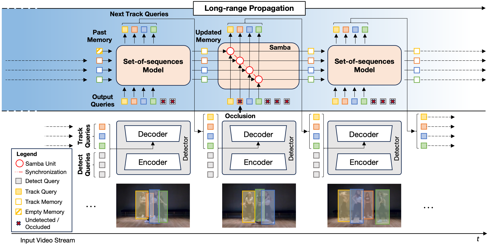
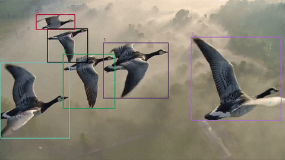

<div align="center">

# Samba: Synchronized Set-of-Sequences Modeling for End-to-end Multiple Object Tracking

<a href="https://arxiv.org/abs/2410.01806"></a>
<a href='https://sambamotr.github.io/'></a>
<a href='https://huggingface.co/mattiasegu/sambamotr'></a>

</div>

<div align="center">
  
</div>

<div>
  <p></p>
</div>

> [**Samba: Synchronized Set-of-Sequences Modeling for End-to-end Multiple Object Tracking**](https://sambamotr.github.io/) <br>
> Mattia Segu, Luigi Piccinelli, Siyuan Li, Yung-Hsu Yang, Luc Van Gool, Bernt Schiele <br>
> ICLR 2025 Spotlight, *Paper at [arXiv 2410.01806](https://arxiv.org/pdf/2410.01806.pdf)*


**SambaMOTR** is a novel tracking-by-propagation framework for multiple object tracking in complex scenarios like dance, sports, and animal groups. It leverages **Samba**, a linear-time set-of-sequences model that synchronizes state-spaces across tracklets to capture long-range dependencies, inter-tracklet interactions, and temporal occlusions. With an autoregressive memory mechanism and a simple uncertainty handling strategy (MaskObs), SambaMOTR tracks objects accurately through occlusions without hand-crafted heuristics. It achieves state-of-the-art results on DanceTrack, BFT, and SportsMOT.

<table align="center">
  <tr>
    <td align="center">
      <br>
      <sub><b>DanceTrack</b></sub>
    </td>
    <td align="center">
      <br>
      <sub><b>BFT</b></sub>
    </td>
    <td align="center">
      <br>
      <sub><b>SportsMOT (Volleyball)</b></sub>
    </td>
    <td align="center">
      <br>
      <sub><b>SportsMOT (Football)</b></sub>
    </td>
  </tr>
</table>


## News :fire:

- 2025.03.26: We’re excited to release the main code and checkpoints!
- 2025.01.22: SambaMOTR has been accepted to ICLR 2025 as a **spotlight** paper! :partying_face: Looking forward to seeing you in Singapore. 

## Installation

### Install with conda
```shell
conda create -n sambamotr -y python=3.11  # create a virtual env
conda activate sambamotr               # activate the env
conda install -y pytorch==2.5.1 torchvision torchaudio pytorch-cuda=12.1 -c pytorch -c nvidia
conda install -y matplotlib pyyaml scipy tqdm tensorboard einops
pip install opencv-python
```

### Install with venv (alternative)
```shell
python -m venv venv/sambamotr
export PYTHONPATH=venv/sambamotr/bin/python
source venv/sambamotr/bin/activate

pip install torch==2.5.1 torchvision torchaudio --index-url https://download.pytorch.org/whl/cu121
pip install matplotlib pyyaml scipy tqdm tensorboard einops
pip install opencv-python
```

### Build Deformable Attention CUDA ops

You also need to compile the Deformable Attention CUDA ops:

```shell
# From https://github.com/fundamentalvision/Deformable-DETR
cd ./models/ops/
# Build for different CUDA architectures (refer to https://arnon.dk/matching-sm-architectures-arch-and-gencode-for-various-nvidia-cards/)
TORCH_CUDA_ARCH_LIST="7.5 8.0 8.6 8.7 8.9" sh make.sh
# You can test this ops if you need:
python test.py
```

## Data

You should put the unzipped DanceTrack, SportsMOT and BFT datasets into the `DATADIR/DanceTrack/`, `DATADIR/SportsMOT/`, and `DATADIR/BFT/`, respectively. If a dataset does not provide the `${SPLIT}_seqmap.txt` file, you can generate it with

```shell
python data/gen_seqmap.py --data-dir $DATA_DIR --split $SPLIT
```

For example:
```shell
# DanceTrack (SPLIT in [train, val])
python data/gen_seqmap.py --data-dir $ROOT_DIR/DanceTrack --split $SPLIT 

# BFT (SPLIT in [train, val, test])
python data/gen_seqmap.py --data-dir $ROOT_DIR/BFT --split $SPLIT
```

Finally, you should get the following dataset structure:
```
DATADIR/
  ├── DanceTrack/
  │ ├── train/
  │ ├── val/
  │ ├── test/
  │ ├── train_seqmap.txt
  │ ├── val_seqmap.txt
  │ └── test_seqmap.txt
  ├── SportsMOT/
  │ ├── train/
  │ ├── val/
  │ ├── test/
  │ ├── train_seqmap.txt
  │ ├── val_seqmap.txt
  │ └── test_seqmap.txt
  └── BFT/
    ├── train/
    ├── val/
    ├── test/
    ├── train_seqmap.txt
    ├── val_seqmap.txt
    └── test_seqmap.txt
```


## Pretrain (Deformable DETR)

We initialize our model with the official Deformable-DETR (with R50 backbone) weights pretrained on the COCO dataset, you can also download the checkpoint we used [here](https://drive.google.com/file/d/1JYKyRYzUH7uo9eVfDaVCiaIGZb5YTCuI/view?usp=sharing). And then put the checkpoint at `pretrained/deformable_detr.pth`.

## Pretrain (DAB-DETR)

We initialize our model with the official DAB-Deformable-DETR (with R50 backbone) weights pretrained on the COCO dataset, you can also download the checkpoint we used [here](https://drive.google.com/file/d/17FxIGgIZJih8LWkGdlIOe9ZpVZ9IRxSj/view?usp=sharing). And then put the checkpoint at `pretrained/dab_deformable_detr.pth`.

## Scripts

### Training
Train SambaMOTR with 8 GPUs on `${DATASET}` (one of `[DanceTrack, SportsMOT, BFT]`):
```shell
python -m torch.distributed.run --nproc_per_node=8 main.py --use-distributed --config-path ./configs/sambamotr/${DATASET}/def_detr/train_residual_masking_sync_longer.yaml --outputs-dir ./outputs/sambamotr/${DATASET}/ --batch-size 1 --data-root <your data dir path>
```
if the model does not fit in your GPU's memory, use the flag `--use-checkpoint` to activate [gradient checkpointing](https://pytorch.org/docs/1.13/checkpoint.html?highlight=checkpoint#torch.utils.checkpoint.checkpoint) and reduce the allocated GPU memory. 
```shell
python -m torch.distributed.run --nproc_per_node=8 main.py --use-distributed --config-path ./configs/sambamotr/${DATASET}/def_detr/train_residual_masking_sync_longer.yaml --outputs-dir ./outputs/sambamotr/${DATASET}/ --batch-size 1 --data-root <your data dir path> --use-checkpoint
```

### Submit and Evaluation
You can use this script to evaluate the trained model on the `${SPLIT}` (one of `[train, val, test]`) set:
```shell
python main.py --data-root <your data dir path> --mode eval --eval-mode specific --eval-dir ./outputs/sambamotr/${DATASET}/ --eval-model <filename of the checkpoint> --eval-data-split ${SPLIT} --eval-threads <your gpus num>
```
for submitting (running inference on the test set), you can use the following scripts:
```shell
python -m torch.distributed.run --nproc_per_node=8 main.py --use-distributed --data-root <your data dir path> --mode submit --submit-dir ./outputs/sambamotr/${DATASET}/ --submit-model <filename of the checkpoint> --submit-data-split test 
```
To reproduce our results, you can download our pre-trained checkpoints from [here](https://drive.google.com/file/...) and move the corresponding one to `./outputs/sambamotr/${DATASET}/` before running the above scripts.

### Demo
`$INPUT_PATH` can be either a folder with frames or an mp4 video located at `${INPUT_PATH}`:

```shell
python demo/demo.py --in_video_path "$INPUT_PATH" --output_dir "$OUTPUT_DIR" --config_path "$CONFIG_PATH" --model_path "$MODEL_PATH" --fps "$FPS"
```

## Pretrained SambaMOTR Weights

The pretrained checkpoints and output files for SambaMOTR are stored at the following Hugging Face link: [HERE](https://huggingface.co/mattiasegu/sambamotr/tree/main)

You can use this link to download the necessary files, such as model weights and outputs, to reproduce the results or use the tracker for your own tasks.

### Results

| Dataset      | Method                      | HOTA  | AssA  | DetA  | IDF1  | MOTA  | Checkpoint                                                  | Output                                                                 |
|--------------|-----------------------------|-------|-------|-------|-------|-------|-------------------------------------------------------------|------------------------------------------------------------------------|
| DanceTrack   | SambaMOTR (Deformable DETR) | 67.2  | 57.7  | 78.6  | 71.3  | 88.1  | [Hugging Face](https://huggingface.co/mattiasegu/sambamotr/blob/main/sambamotr_pretrained/dancetrack/def_detr/sambamotr_dancetrack.pth) | [Hugging Face](https://huggingface.co/mattiasegu/sambamotr/tree/main/sambamotr_pretrained/dancetrack/def_detr/test/tracker)          |
| SportsMOT    | SambaMOTR (Deformable DETR) | 70.5  | 60.6  | 82.2  | 73.3  | 90.4  | [Hugging Face](https://huggingface.co/mattiasegu/sambamotr/blob/main/sambamotr_pretrained/sportsmot/def_detr/sambamotr_sportsmot.pth) | [Hugging Face](https://huggingface.co/mattiasegu/sambamotr/tree/main/sambamotr_pretrained/sportsmot/def_detr/test/tracker)           |
| BFT          | SambaMOTR (Deformable DETR) | 69.6  | 74.2  | 65.4  | 81.2  | 70.2  | [Hugging Face](https://huggingface.co/mattiasegu/sambamotr/blob/main/sambamotr_pretrained/bft/def_detr/sambamotr_bft.pth)         | [Hugging Face](https://huggingface.co/mattiasegu/sambamotr/tree/main/sambamotr_pretrained/bft/def_detr/test/tracker)                 |

## Contributions

If you find any bug in the code, please report to Mattia Segu (mattia.segu@gmail.com)

## Citation

If you find our work useful in your research, please consider citing our publication:

```bibtex
@article{segu2024samba,
  title={Samba: Synchronized Set-of-Sequences Modeling for Multiple Object Tracking},
  author={Segu, Mattia and Piccinelli, Luigi and Li, Siyuan and Yang, Yung-Hsu and Van Gool, Luc and Schiele, Bernt},
  journal={arXiv preprint arXiv:2410.01806},
  year={2024}
}
```

## Acknowledgements

- [Deformable DETR](https://github.com/fundamentalvision/Deformable-DETR)
- [DAB DETR](https://github.com/IDEA-Research/DAB-DETR)
- [MOTR](https://github.com/megvii-research/MOTR)
- [MeMOTR](https://github.com/MCG-NJU/MeMOTR)
- [TrackEval](https://github.com/JonathonLuiten/TrackEval)
